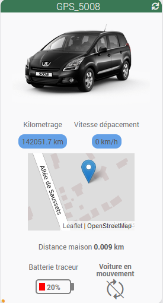
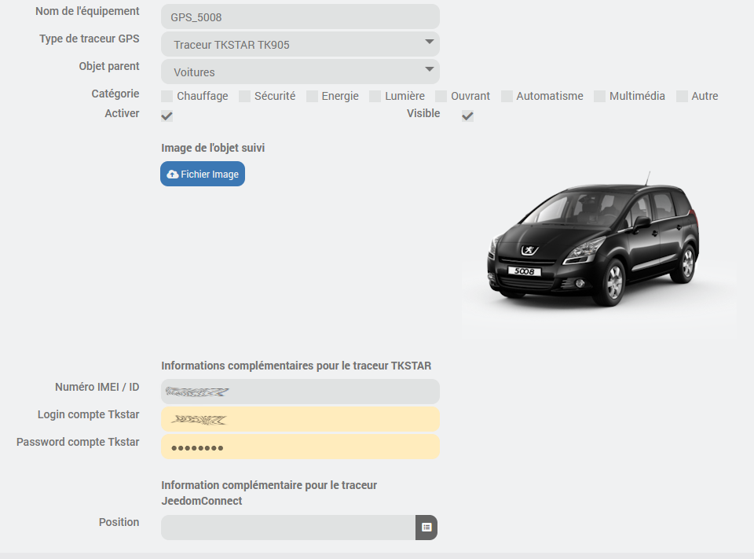
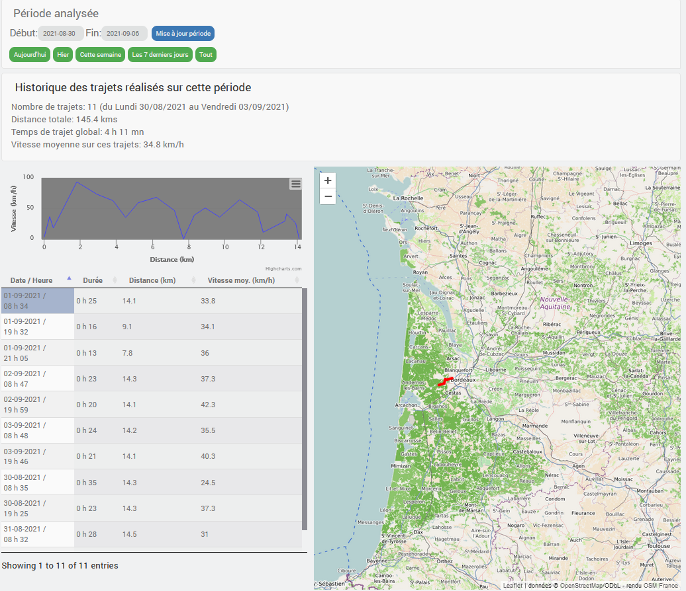

# plugin-GPS-Tracker

## Fonctions

Ce plugin permet de capturer les trajets enregistrés par un traceur GPS, et de les organiser dans une base de données locale. 
Cela permet de suivre une voiture, un bateau, un vélo ou un piéton. 

Il permet de gérer 2 traceurs GPS dans sa première version:
* Un traceur GPS TKSTAR : [TK905](https://www.cdiscount.com/search/10/tk905.html#_his_)
* Un téléphone avec l'application JeedomConnect installée

Les informations disponibles dans le widgets sont:
* Situation de l'objet suivi sur une carte (Position GPS), distance au domicile, et information si l'objet se déplace.
* Vitesse de déplacement de l'objet suivi.
* Distance totale parcourue.
* L'état de la batterie du traceur.

  

## Installation
Par source Github:
* Aller dans Jeedom menu Plugins / Gestion des plugins
* Sélectionner le symbole + (Ajouter un plugin)
* Sélectionner le type de source Github (Il faut l'avoir autorisé au préalable dans le menu Réglages / Système / Configuration => Mise à jour/Market)
* Remplir les champs:
  * ID logique du plugin : gps_tracker
  * Utilisateur ou organisation du dépôt : lelas33
  * Nom du dépôt : plugin_gps_tracker
  * Branche : master
* Lorsque l'installation est finie, faire un refresh de la page. Le plugin "GPS-Tracker" doit apparaitre.
* Sélectionner le plugin et l'activer.

## Configuration
Une fois l'installation effectuée: 
Sur l'onglet "**Equipement**", sélectionner le type de traceur GPS utilisé (TK905 ou JeedomConnect), et choisissez l'objet parent. 
Vous pouvez ensuite télécharger une image de l'objet suivi, qui sera reprise dans le widget et le pannel. 

  

Il faut saisir ensuite quelques informations complémentaires selon le type de traceur. 
Pour le traceur TKSTAR:
* Le Numéro IMEI / ID du traceur
* Les paramètres de login au compte associé. (Login / mot de passe)

Pour le traceur Jeedom connect, il faut saisir le paramètre suivant qui est un champ "info" de votre équipement Téléphone dans le plugin JeedomConnect.
* Position GPS courante

Il faut également activer l'option "Ajouter données à la position" dans l'équipement JeedomConnect. 
Cela permettra d'ajouter l'altitude, l'activité et le niveau de batterie aux informations de position. 
Il sera donc possible de visualiser la coupe de profil des trajets. 

La page du panel à besoin de connaitre les coordonnées GPS de stationnement habituel de la voiture afin de centrer la carte pour l’affichage des trajets.  
Pour cela, il faut renseigner ces coordonnées GPS dans la page de configuration de jeedom. 
Règlages => Système => Configuration => Informations  

  

## Widget
Le widget est configuré automatiquement par le plugin lors de la création de l'équipement. 
La photo de l'objet doit s'afficher sur le widget. 
Lorsque l'on clique sur la photo, on bascule sur la page "Panel" du plugin associée à l'objet suivi. 

## Panel
Une page de type "panel" est disponible pour le plugin dans le menu Acceuil de jeedom.  
Cette page permet de consulter les informations suivantes sur 3 onglets différents:
* Liste des trajets effectués par l'objet tracé
* Statistiques sur l'utilisation de l'objet tracé
* Configuration

**Affichage des trajets:**
Il est possible de définir une période soit par 2 dates, soit par des racourcis ('Aujourd'hui', 'hier', 'les 7 derniers jours' ou 'tout'), puis d'afficher l'ensemble des trajets sur cette période. 
La suite de la page est mise à jour avec l'affichage des trajets sélectionnés, en tableau et en affichage sur une carte. (Openstreet map)  
On peut sélectionner les trajets 1 par 1 dans le tableau pour afficher un seul trajet dans la liste.  
Un résumé sur l'ensemble des trajets sélectionnés et donné également sur cette page.

Si les informations de vitesse, ou d'altitude sont disponibles dans les informations fournies par le traceur, alors elles seront affichées sous forme de profil. 
Et si l'on clique sur un point du profil, la position correspondante est affichée sur la carte.

  

**Statistiques:**
Présentation sous forme de graphe des distances parcourues par l'objet suivi, basées sur l'historique des trajets mémorisés.

**Configuration:**
Cette page permet de définir La valeur courante du kilométrage de l'objet suivi.  

