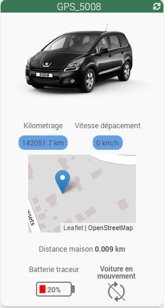
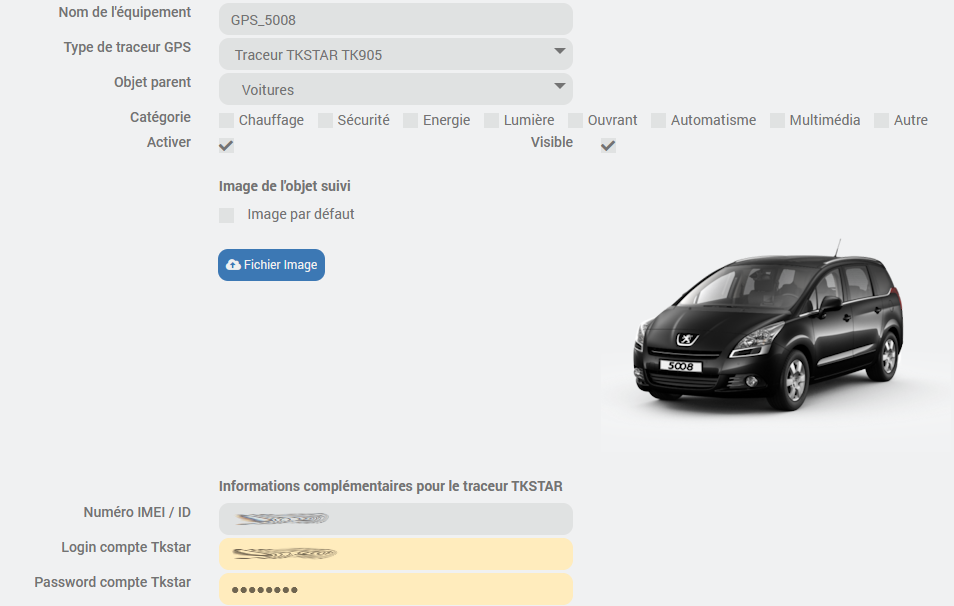
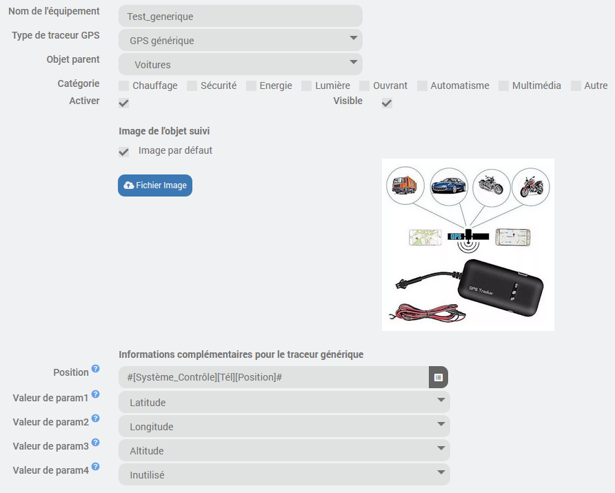

# plugin-GPS-Tracker

## Fonctions

Ce plugin permet de capturer les trajets enregistrés par un traceur GPS, et de les organiser dans une base de données locale. 
Cela permet de suivre une voiture, un bateau, un vélo ou un piéton. 

Il permet de gérer plusieurs types de traceurs GPS:
* Un traceur GPS TKSTAR : [TK905](https://www.cdiscount.com/search/10/tk905.html#_his_)
* Un téléphone avec les applications JeedomConnect ou Jeemate installée
* Un traceur intégré dans une base Traccar
* Un traceur "générique" fournissant ses données dans une info Jeedom

Les informations disponibles dans le widgets sont:
* Situation de l'objet suivi sur une carte (Position GPS), distance au domicile, et information si l'objet se déplace.
* Vitesse de déplacement de l'objet suivi.
* Distance totale parcourue.
* L'état de la batterie du traceur.

  

## Installation
Par source Github:
* Aller dans Jeedom menu Plugins / Gestion des plugins
* Sélectionner le symbole + (Ajouter un plugin)
* Sélectionner le type de source Github (Il faut l'avoir autorisé au préalable dans le menu Réglages / Système / Configuration => Mise à jour/Market)
* Remplir les champs:
  * ID logique du plugin : gps_tracker
  * Utilisateur ou organisation du dépôt : lelas33
  * Nom du dépôt : plugin_gps_tracker
  * Branche : master
* Lorsque l'installation est finie, faire un refresh de la page. Le plugin "GPS-Tracker" doit apparaitre.
* Sélectionner le plugin et l'activer.

## Configuration
Une fois l'installation effectuée: 
Sur l'onglet "**Equipement**", sélectionner le type de traceur GPS utilisé (TK905, JeedomConnect, Jeemate, GPS Traccar ou GPS générique), et choisissez l'objet parent. 
Vous pouvez ensuite télécharger une image de l'objet suivi, qui sera reprise dans le widget et le pannel. 
Il est possible de sélectionner une image par défaut en cochant la case correspondante. 
Il faut saisir ensuite quelques informations complémentaires selon le type de traceur. 

  

Pour le traceur TKSTAR:
* Le Numéro IMEI / ID du traceur
* Les paramètres de login au compte associé. (Login / mot de passe)

  

Pour le traceur Jeedom connect, il faut saisir le paramètre suivant qui est un champ "info" de votre équipement Téléphone dans le plugin JeedomConnect.
* Position: [Position]
Il faut également activer l'option "Ajouter données à la position" dans l'équipement JeedomConnect. 
Cela permettra d'ajouter l'altitude, l'activité et le niveau de batterie aux informations de position. 
Il sera donc possible de visualiser la coupe de profil des trajets. 

  

Pour le traceur Jeemate connect, il faut saisir les 3 paramètres suivants qui sont des champs "info" de votre équipement Téléphone dans le plugin JeedomMate.
* Position: [(GeoLoc) Position]
* Activité: [(GeoLoc) Type activité]
* Batterie: [State Battery]

  

Pour le traceur GPS Traccar, il faut saisir les 3 paramètres suivants pour définir l'accès au serveur Traccar dans lequel votre traceur GPS est enregistré.
* URL du serveur tracecar: URL (interne ou externe) de votre serceur traccar, avec le numéro de port utilisé. Par exemple http://192.168.1.1:8082
* Login de connexion au serveur
* Mot de passe de connexion au serveur
Lorsque ces 3 premiers paramètres sont définis, vous pouvez sauvegarder votre équipement une première fois. 
Ensuite, revenez sur cette page de configuration de l'équipement, et en sélectionnant le bouton [liste "devices"], vous vérez les 3 champs suivants se remplir avec les dentifiants des traceurs GPS contenus dans la base traccar. 
Si vous avez plusieurs traceurs dans la base, vous pouvez les faire défiler en cliquant plusieurs fois sur le bouton [liste "devices"]. 
Lorsque le bon traceur est choisi, faire à nouveau une sauvegarde de l'équipement. 

  

Pour le traceur GPS Générique, les informations attendues sont issues du champ information d'un équipement Jeedom, sous la forme de 4 paramètres séparés par des virgules. 
Il faut donc définir les 5 paramètres suivants:
* Position: Lien vers le champ information contenant les informations du traceur.
* Valeur de param 1 à 4: configuration respective des 4 paramètres issus du champ précédent. Cela peut être Latitude, Longitude, Altidude, Vitesse ou bien inutilisé.

La page du panel à besoin de connaitre les coordonnées GPS de stationnement habituel de la voiture afin de centrer la carte pour l’affichage des trajets.  
Pour cela, il faut renseigner ces coordonnées GPS dans la page de configuration de jeedom. 
Règlages => Système => Configuration => Informations  

  

## Widget
Le widget est configuré automatiquement par le plugin lors de la création de l'équipement. 
La photo de l'objet doit s'afficher sur le widget. 
Lorsque l'on clique sur la photo, on bascule sur la page "Panel" du plugin associée à l'objet suivi. 

## Panel
Une page de type "panel" est disponible pour le plugin dans le menu Acceuil de jeedom.  
Cette page permet de consulter les informations suivantes sur 3 onglets différents:
* Liste des trajets effectués par l'objet tracé
* Statistiques sur l'utilisation de l'objet tracé
* Configuration

**Affichage des trajets:**
Il est possible de définir une période soit par 2 dates, soit par des racourcis ('Aujourd'hui', 'hier', 'les 7 derniers jours' ou 'tout'), puis d'afficher l'ensemble des trajets sur cette période. 
La suite de la page est mise à jour avec l'affichage des trajets sélectionnés, en tableau et en affichage sur une carte. (Openstreet map)  
On peut sélectionner les trajets 1 par 1 dans le tableau pour afficher un seul trajet dans la liste.  
Un résumé sur l'ensemble des trajets sélectionnés et donné également sur cette page.

Si les informations de vitesse, ou d'altitude sont disponibles dans les informations fournies par le traceur, alors elles seront affichées sous forme de profil. 
Et si l'on clique sur un point du profil, la position correspondante est affichée sur la carte.

  

**Statistiques:**
Présentation sous forme de graphe des distances parcourues par l'objet suivi, basées sur l'historique des trajets mémorisés.

**Configuration:**
Cette page permet de définir La valeur courante du kilométrage de l'objet suivi.  

